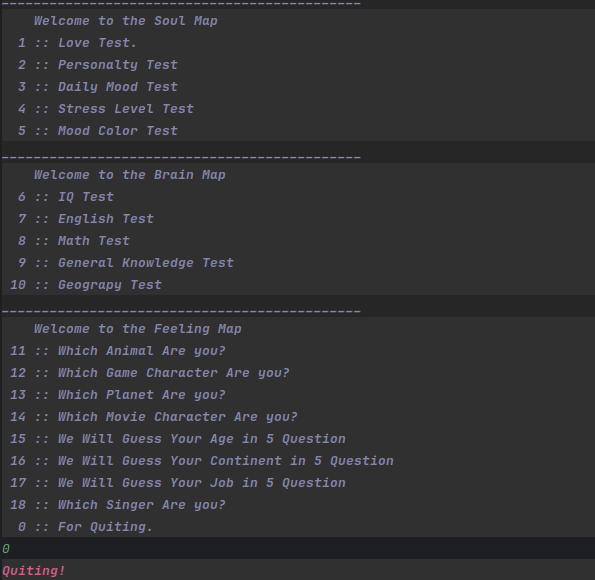
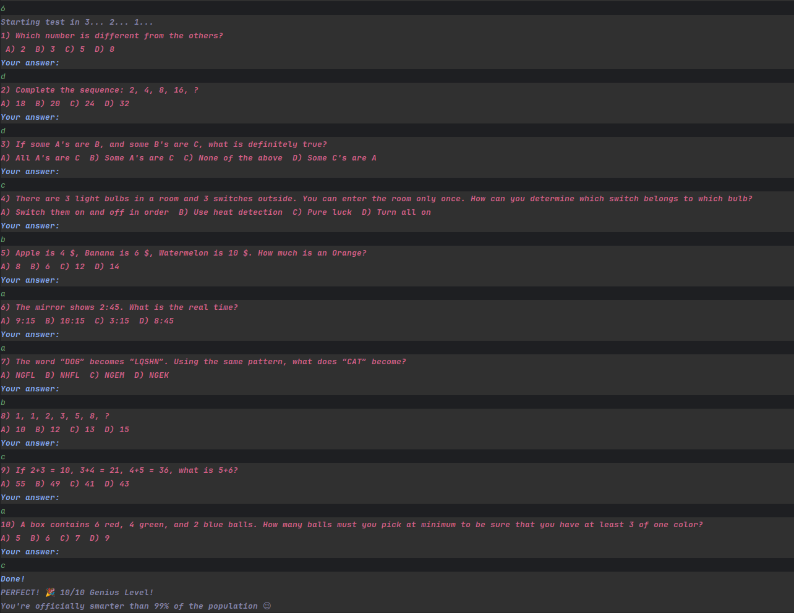
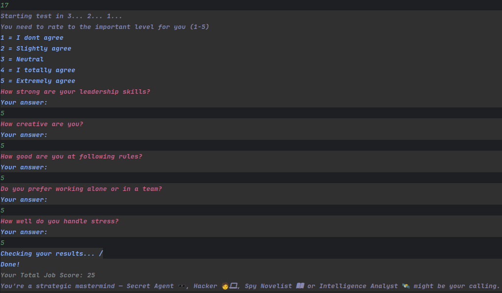
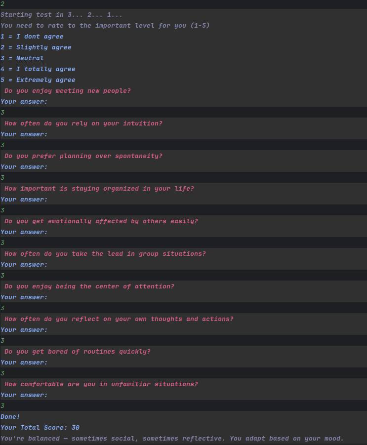

# 🧠 Soul_Map 🎯

A feature-rich **C++ terminal application** offering **17+ psychological, logical, and personality tests** — from IQ quizzes to “Which Game Character Are You?” styled outputs.  
Designed with OOP principles, dynamic scoring logic, and a colorful CLI interface.

---

## 📌 Features

✅ **17 Interactive Personality Tests**  
🧠 IQ, Math, English, General Knowledge, Geography  
💖 Love, Daily Mood, Stress, Mood Color  
🎭 Game Character, Animal, Planet, Movie Character  
🎧 Singer Matching, Age Prediction, Job & Continent Guesser

---

✅ **Beautiful CLI Design with Colors & Icons**  
🎨 Terminal colors for categories  
💬 Custom result messages with emojis  
🔁 Animated countdown before tests

---

✅ **Fully Modular C++ Project**  
📂 Each test in its own `.cpp/.hpp` file  
🔄 Easy to expand with new tests  
🧱 CMake-based build system

---

✅ **Dynamic Scoring System**  
🧮 Each answer contributes to a final mapped identity  
🔢 Real-time score calculation

---

✅ **Clean Menu Navigation**  
🧭 Main menu groups tests into Soul, Brain, and Feeling sections  
🔁 Looped selection system for user flexibility

---

✅ **Project Structure Optimized for Contribution**  
🧠 Clear naming conventions  
🔍 Readable, documented functions  
⚙️ `.gitignore`, `.gitattributes`, `README.md` all included

## ✍️ Content Credits

- All code and logic are original and written by the developer.
- However, some of the **test questions** and **string-based content** (like result messages, prompts, etc.) were **assisted by ChatGPT (OpenAI)** during brainstorming and generation.
- This helped speed up the creative process while keeping the final implementation fully customized and original.

---

## 📸 Demo Screenshots

### 📋 Main Menu


### 🧠 IQ Test


### 💼 Job Test


### 🎭 Personality Test


---

## ⚙️ How to Run

```bash
git clone https://github.com/puduk/Soul_Map.git
cd Soul_Map
mkdir build && cd build
cmake ..
make
./Soul_Map
```

---


